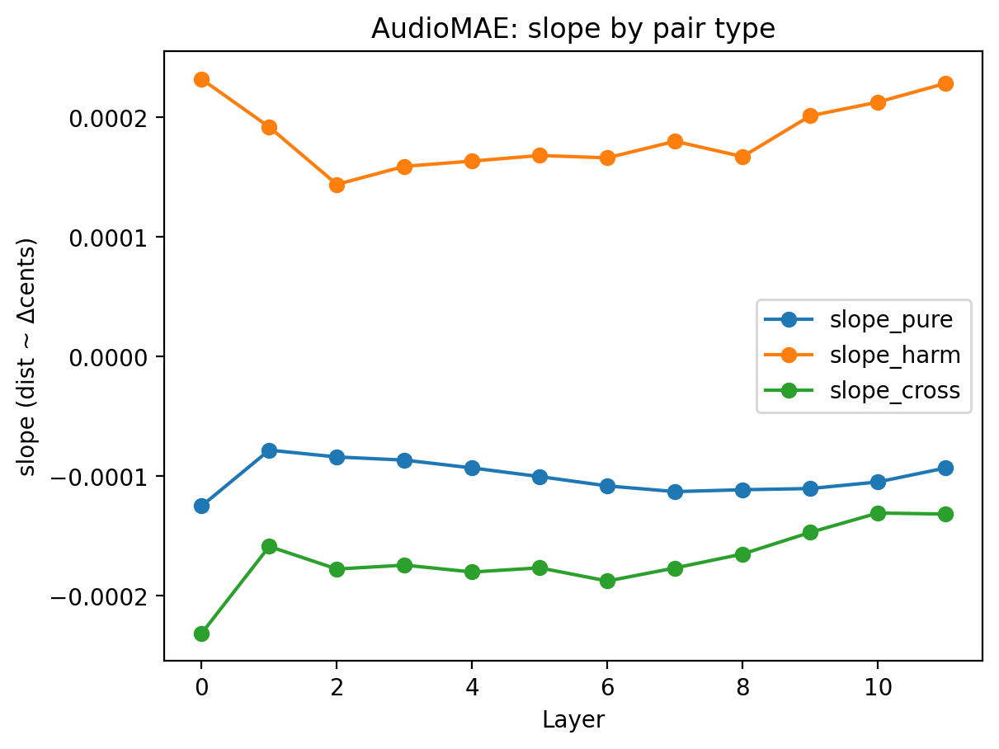
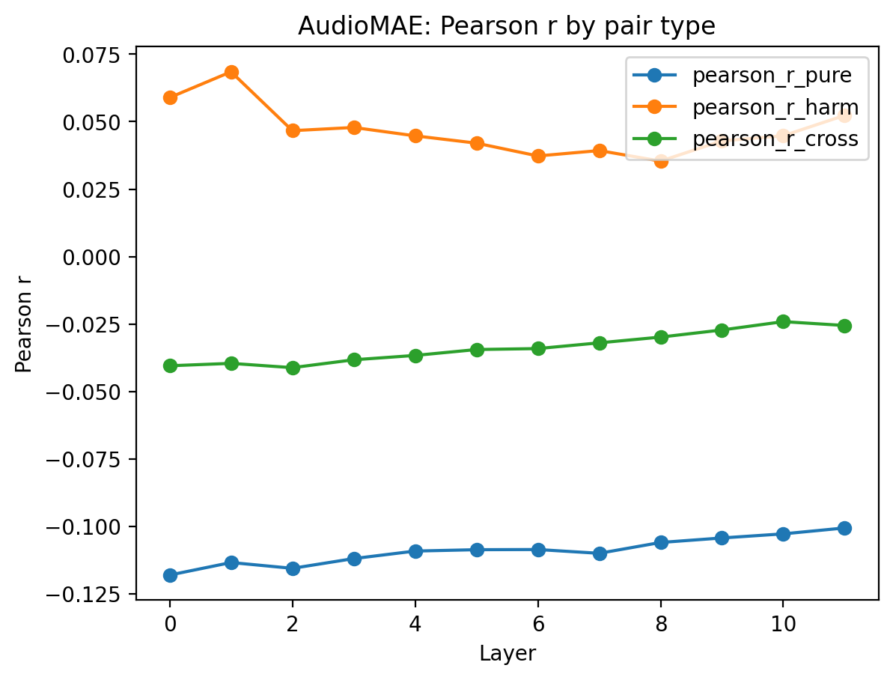
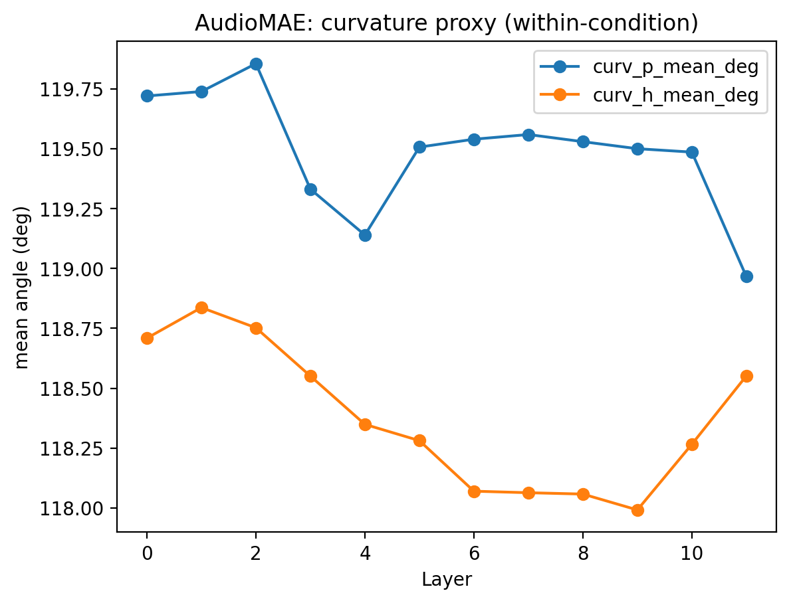

# AudioMAE: Layerwise Pitch Geometry Analysis(Stimuli v2)
Writer : 이다빈

## 1. 연구목적

- AudioMAE의 layerwise representation이 미세 피치 변화($\Delta$ cent)를 어떤 Geometry로 표현하는지를 정량적으로 평가하기 위한 것이며 특히 다음 질문에 초점을 둔다.
    
    - $\Delta$ cent가 embedding distance에 선형적으로 반영되는지 여부.
    - pure tone 과 harmonic tone 에서 pitch geometry가 다르게 형성되는지 여부
    - representation depth(layer)에 따라 pitch geometry가 **유지/ 변형/ 붕괴**의 여부

## 2. 실험 설정 요약

### 2-1. Stimuli (v2)

- F0 : **A3/ A4/ A5**
- $\Delta$ cent : $\pm1, \pm2, \pm3, \pm5, \pm10, \pm20$
- 조건

    - **Pure tone**
    - **Harmonic tone**
    - 총 자극 수 : **78 (Pure 39 / Harmonic 39)**

### 2-2. Embedding

- 모델 : AudioMAE
- Layerwise Embedding shape: **(78, 12, 768)**
- 각 layer에서 stimulus 간 pairwise distance 계산

## 3. Geometry Metrics
각 layer 별로 다음 지표를 계산하였음.

- **slope** : distance ~ $\Delta$ cent 회귀 계수
- **Pearson r** : $\Delta$ cents-distance monotonicity
- **Curvature proxy**: within-condition trajectory의 평균 굴곡 각독(deg)

Pair type:
    
- pure-pure
- harmonic-harmonic
- pure-harmonic(cross)

## 4. 결과
### 4.1 Slope($\Delta$ cents -> distance)

**관찰**
- harmonic-harmonic slope는 **전 레이어에서 양수**이며 비교적 안정적
- pure-pure slopesms **중,후반 레이어에서 음수**
- cross slope는 초기에는 양수, 이후 점차 약화

**해석**
- AudioMAE는 harmonic tone에서 pitch offset을 거리 축으로 비교적 안정적으로 유지
- pure tone에서는 깊은 레이어로 갈수록 pitch가 주요 거리 축에서 밀려나는 경향

### 4.2 Pearson r(monotonicity)

**관찰**
- harmonic–harmonic r은 **전반적으로 양수**
- pure–pure r은 빠르게 **음수 영역으로 이동**
- cross r은 약한 음수로 수렴

**해석**
- harmonic tone에서는 pitch order가 representation에 비교적 잘 보존
- pure tone에서는 pitch ordering이 깊은 레이어에서 붕괴

### 4.3 Curvature(within-condition)

**관찰**
- harmonic curvature > pure curvature (모든 layer)
- layer depth 증가에 따라 curvature는 완만히 감소

**해석**
- harmonic tone은 배음 구조로 인해 **비선형 pitch manifold** 형성
- AudioMAE는 깊은 레이어에서도 harmonic manifold를 완전히 평탄화하지 않음

## 5. 결론
- AudioMAE는 **harmonic tone에 대해 pitch geometry를 비교적 안정적으로 유지**
- pure tone에서는 pitch axis가 깊은 layer에서 약화
- 이는 AudioMAE의 **reconstruction 기반 SSL Objective**가 스펙트럼 구조(특히 harmonicity)에 민감함을 시사.

## 6. 시사점
- AudioMAE는 **음악적/청각적 pitch structure 연구에 적합한 모델 후보**
- 특히 harmonic pitch perception과의 연결 가능성 존재