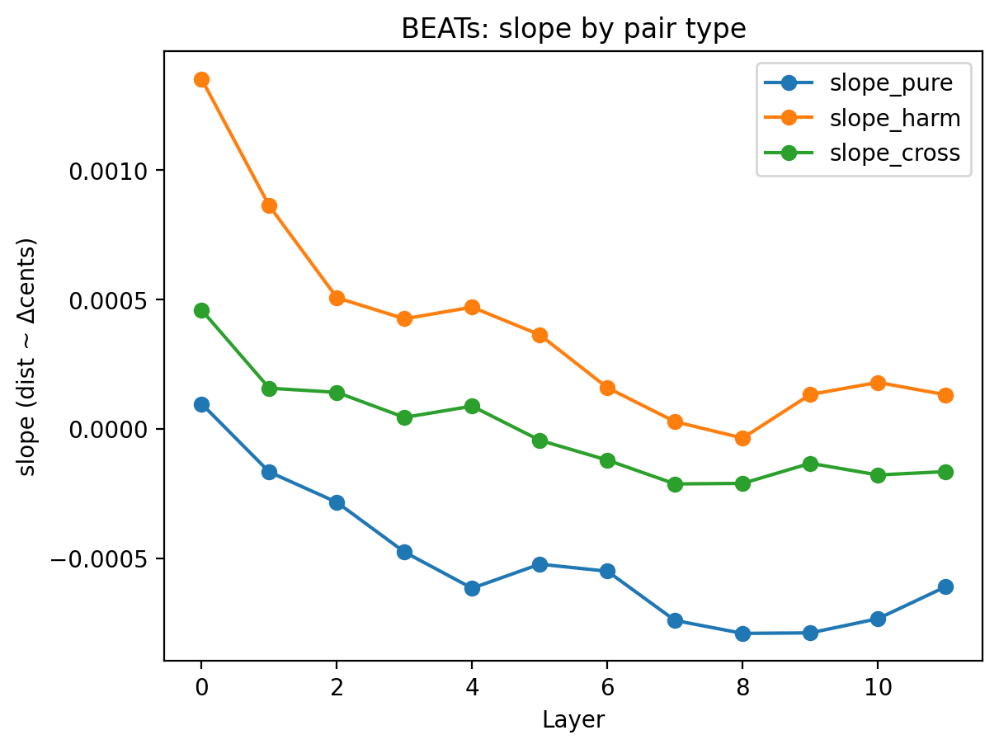
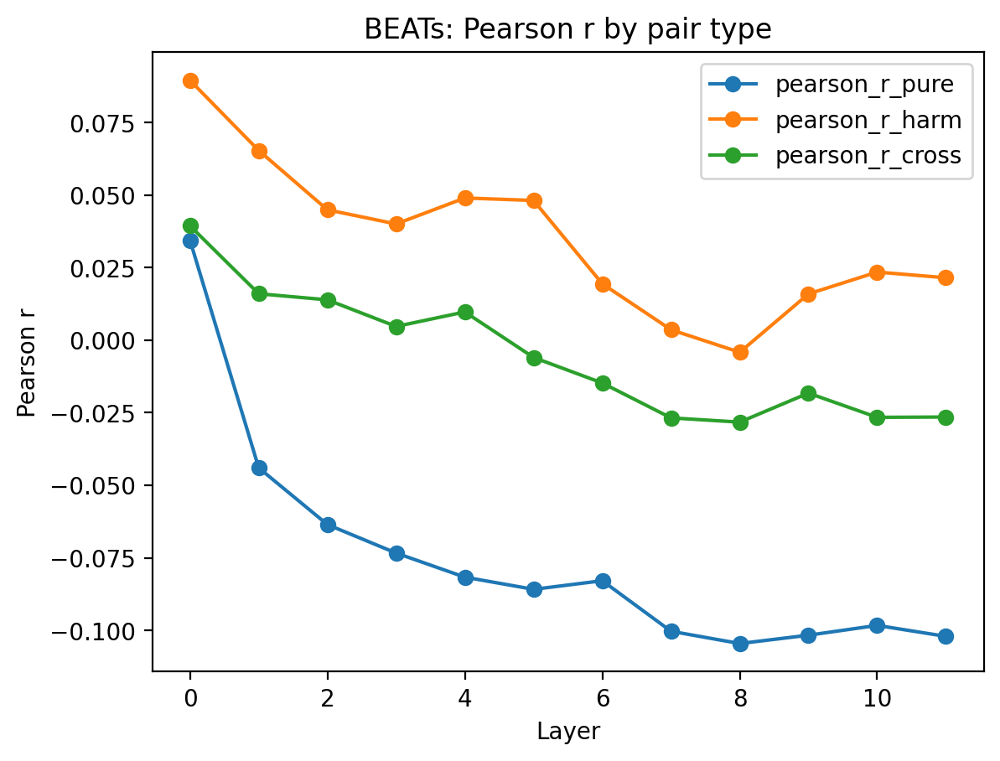
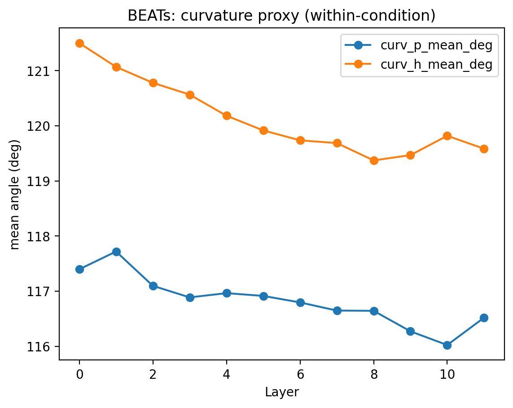

# BEATs: Layerwise Pitch Geometry Analysis(Stimuli v2)
Writer : 이다빈

## 1. 연구목적

- **BEATs의 layerwise representation**에서 미세 피치 변화($\Delta$ cents)가 어떤 방식으로 인코딩되는지 AudioMAE와 동일한 프로토콜로 평가하기 위함이며, 핵심질문은 다음과 같다.
    
    - BEATs는 **pitch offset을 representation 거리 축으로 유지하는가?**
    - harmonic / pure 조건에서 pitch geometry 차이가 존재하는가?
    - semantic-oriented SSL 모델에서 pitch geometry는 **어느 layer에서 소실되는가?**

## 2. 실험 설정 요약

- Stimuli, pair type, geometry metric 정의는 **AudioMAE 분석과 동일**
- 모델: **BEATs (iter3)**
- Layerwise embedding shape: **(78, 12, 768)**

## 3. 결과
### 3.1 Slope($\Delta$ cents -> distance)

**관찰**
- harmonic slope는 **초기 레이어에서 매우 큼**
- layer가 깊어질수록 **급격히 감소**
- pure/cross slope는 중·후반 레이어에서 0 근처 또는 음수

**해석**
- BEATs는 **초기 acoustic feature 단계에서는 pitch 변화에 민감**
- 그러나 깊은 layer로 갈수록 pitch offset이 거리 구조에서 제거됨

### 3.2 Pearson r(monotonicity)

**관찰**
- harmonic r은 초반에는 높으나 중반 이후 급락
- pure r은 빠르게 음수 영역
- cross r은 점진적으로 음수로 이동

**해석**
- BEATs representation에서는 pitch ordering이 **깊은 Layer에서 유지되지 않음**
- semantic abstraction 과정에서 pitch axis가 소실되는 양상상

### 3.3 Curvature(within-condition)

**관찰**
- harmonic curvature는 초기에는 크지만 지속적으로 감소
- pure curvature는 낮고 빠르게 평탄화

**해석**
- BEATs는 pitch trajectory를 **점진적으로 flatten**
- harmonic manifold조차 후반 layer에서는 단순화됨

## 5. 결론
- BEATs는 **초기 레이어에서만 pitch-sensitive**
- 깊은 레이어에서는 pitch geometry가 **의미적으로 중요하지 않은 정보로 제거**
- 이는 BEATs의 **audio event / semantic 중심 pretraining objective**와 일관됨

## 6. AudioMAE와 대비
| 항목               | AudioMAE          | BEATs                |
|--------------------|-------------------|----------------------|
| Pitch slope 유지   | harmonic에서 유지 | 초반만 유지          |
| Curvature          | harmonic에서 지속 | 빠른 평탄화          |
| Pitch Monotonicity | 부분 유지         | 붕괴                 |
| Inductive bias     | reconstruction    | semantic abstraction |

## 7. 시사점.
- 동일한 stimuli, 동일한 geometry 분석에도 불구하고 **모델의 학습 목표(SSL objective)가 pitch geometry를 근본적으로 다르게 형성**
- AudioMAE는 **pitch-perception/음악 인지 연구에 더 적합**
- BEATs는 **semantic audio understanding에는 적합하나, pitch hyperacuity에는 부적합**