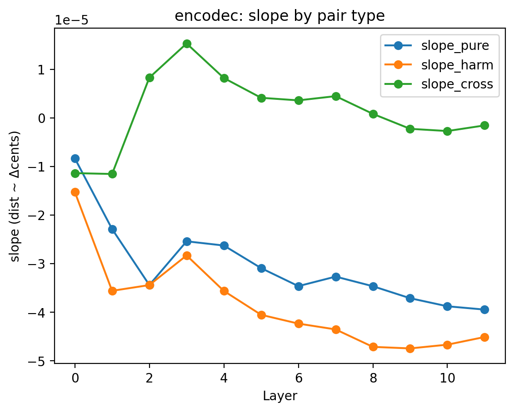
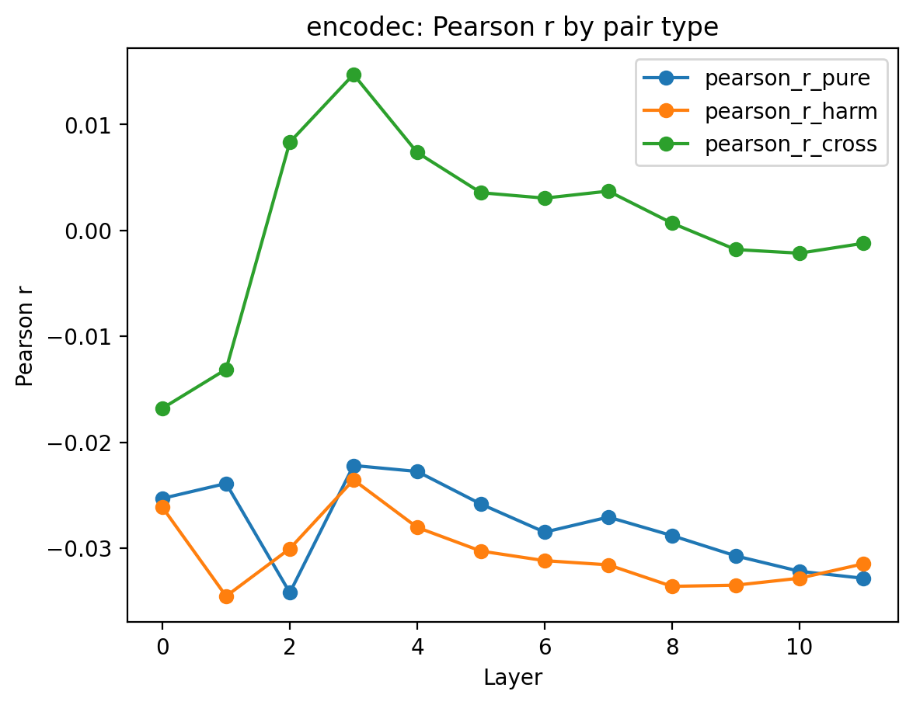
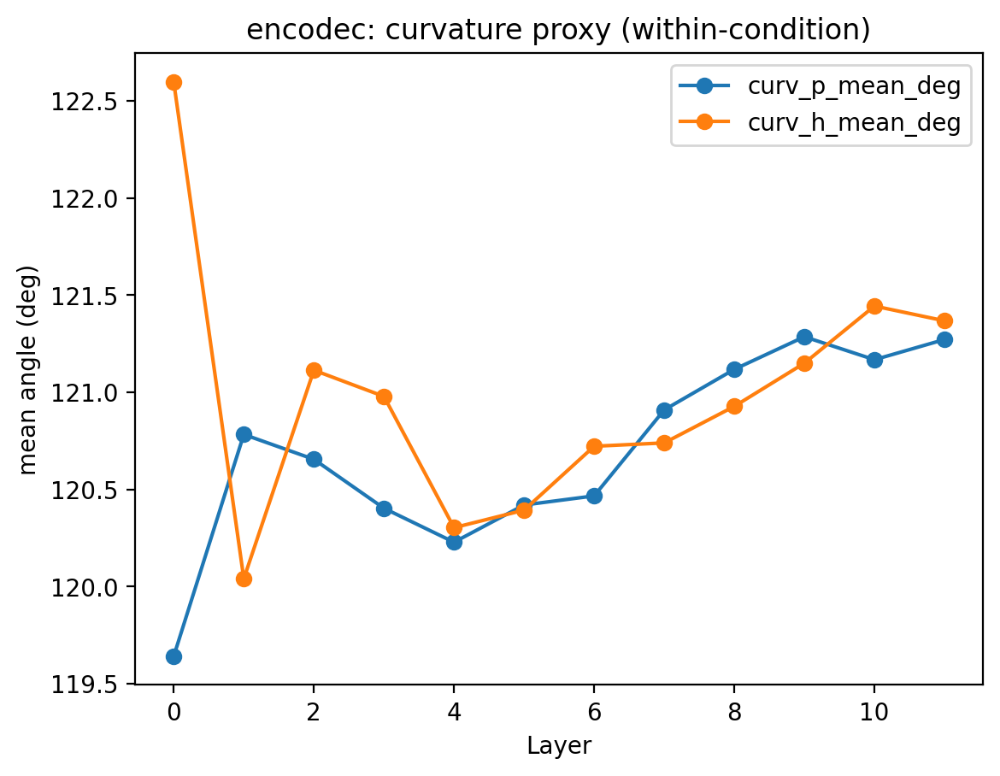

# Encodec Representation Geometry Analysis(Stimuli v2)
Writer : 이다빈

## 1. 목적

본 분석의 목적은 **신경코딩 관점에서의 pitch representation**이
- **SSL 기반 acoustic representation(AudioMAE, BEATs)**과
- **신경신호 압축 기반 neural audio codec(Encodec)**

사이에서 **기하학적으로 어떻게 다른지를 비교**하는 데 있다.

Encodec은 **self-supervised encoder–decoder 구조**를 갖지만, 학습 목적이 **semantic abstraction**이 아니라 **waveform 재구성 + bitrate-efficient quantization**에 최적화되어 있다.
따라서 Encodec representation은:
- “pitch geometry를 학습한다”기보다
- “pitch를 얼마나 안정적으로 보존/압축하는가”를 반영할 가능성이 높다.

이 차이가 geometry 지표에 어떻게 드러나는지를 확인하는 것이 핵심 질문이다.

## 2. 실험 설정 요약

### Stimuli
- **Stimuli v2**
    - **A3 - A5**
- $\pm1, 2, 3, 5, 10, 20$ cents

### Encodec 설정

- **SampleRate** : 24kHz
- **Quantizer**: Residual Vector Quantizer
- **#Quantization layers**: 12
- **Embedding shape**:
```(Mathmatica)
(N=78, L=12, D=128)
```
D=128인 이유:
- "encodec latent는 **codec bottleneck**"
- "AudioMAE/BEATs의 768-d Transformer hidden과 **개념적으로 다른 공간**"

## 3. Geometry Metrics
동일한 geometry 분석 파이프라인 사용:

- **slope**
    - 거리 vs pitch difference (cent)
- **Pearson r**
    - Embedding distance <-> pitch difference
    - pitch ordering consistency
- **Curvature proxy**:
    - within-condition triplet angle
    - representation manifold의 “휘어짐”

## 4. 결과
### 4.1 Slope($\Delta$ Distance / $\Delta$ Cents)

**관찰**
- 모든조건에서 slope 크기가 **$10^{-5}$ 수준**
- harmonic / pure 모두
    - layer가 깊어질수록 **더 음수 방향**
- cross slope는
    - 중간 layer에서 약간 양수
    - 이후 0 근처로 수렴

**해석**
- Encodec embedding distance는
    - pitch 차이에 거의 반응하지 않음.
- Slope 감소는
    - Quantization depth 증가 -> information bottleneck 강화 효과로 해석 가능 

### 4.2 Pearson r(Pitch-Distance Correlation)

**관찰**
- 전체적으로 **$\vert r \vert$ 매우 작음.**
    - pure, harmonic 모두 $\vert r \vert \approx 0.02-0.03$ 수준
- cross-condition은
    - 초반에 약간 양수
    - 후반부에서 0 근처로 수렴

**해석**
- Encodec Latent는
    - **Pitch distance ordering**을 명시적으로 보존하지 않음.
    - metric pitch space로 해석하기 어려움
- 이는 "Encodec은 pitch를 **인식**하지 않고 **전달**한다"는 구조적 차이를 반영

### 4.3 Curvature(within-condition)

**관찰**
- Pure / Harmonic 모두 **$120-121^\circ$ 근처**
- AudioMAE/BEATs보다 **전반적으로 더 큰 각도**
    - -> **더 평탄한(local linear) manifold**
- Early layer에서 harmonic curvature가 다소 높으나, layer가 깊어질수록 **pure-harmonic 차이가 축속**

**해석**
- Encodec latent space는
    - **pitch-specific bending을 적극적으로 만들지 않음**
    - waveform fidelity를 유지하는 방향으로 **균질한 압축 공간** 형성
- harmonic의 초기 curvature 증가는
    - spectral complexity → quantization burden 증가 효과로 해석 가능

## 5. 결론
- AudioMAE는 **harmonic tone에 대해 pitch geometry를 비교적 안정적으로 유지**
- pure tone에서는 pitch axis가 깊은 layer에서 약화
- 이는 AudioMAE의 **reconstruction 기반 SSL Objective**가 스펙트럼 구조(특히 harmonicity)에 민감함을 시사.

## 6. 시사점
- AudioMAE는 **음악적/청각적 pitch structure 연구에 적합한 모델 후보**
- 특히 harmonic pitch perception과의 연결 가능성 존재


----
“Encodec은 pitch를 인식하는 representation이라기보다, pitch를 왜곡 없이 전달하기 위한 압축 공간이며, 그 결과 pitch geometry가 거의 형성되지 않은 듯.”